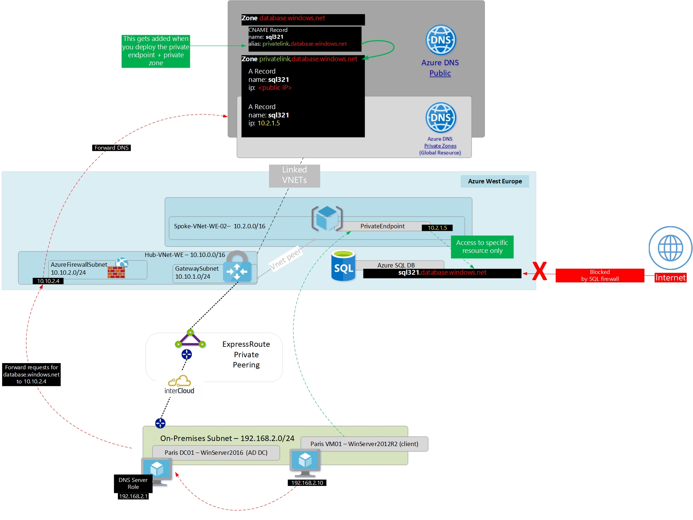

# Using Azure Firewall as DNS Forwarder with Private Link

## Introduction

When working with Azure Private Link it is required to modify default DNS forwarding to make use of the Private Endpoints to access PaaS Services (And Azure Private Link Services) in a secure way. Specifically, by default, lookups to public FQDNs used by Microsoft PaaS Services (E.g. .database.windows.net for Azure SQL) will return a public IP address. We have to modify the configuraiton of DNS to return a Private IP address which maps to the NIC used by a Private Endpoint. 

This article is not a full explanation of the above, please consider the following articles required pre-reading to build foundational knowledge before implementing this solution.

aka.ms/whatisprivatelink Introductory video on Private Link
aka.ms/whyprivatelink High level white paper exploring the requirement for Private Link
aka.ms/privatelinkdns Technical white paper introducing the DNS challenge when working with Private Link

## Azure Firewall DNS Proxy

This feature was released in public preview on 30th June 2020. Please see the official documentation here. https://docs.microsoft.com/en-us/azure/firewall-manager/dns-settings

In short, when enabled, DNS Proxy will listen on port 53 for requests and forward them, by default to Azure DNS, or to the customer DNS server specified within Azure Firewall customer DNS settings.

## Why does this help Private Link?

As explained here https://github.com/dmauser/PrivateLink/tree/master/DNS-Integration-Scenarios#4-on-premises-dns-integration one of the big benefits of Azure Private Link is the ability to consume Microsoft PaaS services on Private IP's over Privately address hybrid connections; Azure ExpressRoute Private Peering and Site-to-Site VPNs. However, this benefit also comes with the challenge of forwarding DNS requests from On-Premises to Azure DNS, to benefit from the automated lifecycle management of DNS records that map to your Private Endpoints.

At the core of this problem, is that only resources inside of a Virtual Network can query the 168.63.129.16 "special" address used by Azure DNS Private Zones to recieve requests. Therefore DNS requests from On-Premises need to be "proxied" via a resource inside of the Virtual Network. Some customers will use their existing DNS servers to acomplish this; E.g. Azure DNS on Windows Server, Infoblox, BIND. However, there are some customers that do not want to manage this DNS infrastrucutre in the "VNet", and they would like a PaaS service to perform this function.

This article shows how the new Azure Firewall DNS Proxy feature can be used in this way.

## Topology

The following diagram shows the lab environment used to show this functionaility working, in short an On-Premises environment connected to Azure via an ExpressRoute Private Peering. The On-Premises location has a DNS server that is configured to forward unknown DNS requests to an external ISP DNS infrastrucutre. The DNS server is also configured to conditionally forward *.database.windows.net* to the Private IP address of Azure Firewall. An Azure Firewall inside of a Virtual Network that is linked to an Azure DNS Private Zone for privatelink.database.windows.net.

(Click image to fix see larger file and fix resolution, will upload better image soon)

## DNS packet walk

- [1] On-Premises VM attempts to resolve sql321.database.windows.net
- [2] DNS request is forwarded to 192.168.2.1 (on-premises DNS server)
- [3] On-premises DNS server has a conditional forwarder configured for database.windows.net pointing at 10.10.2.4 (The Private VIP of Azure Firewall)
- [4] Azure Firewall recieves the request and forwards (by default) to Azure DNS
- [5] Azure public DNS returns CNAME record for sql321.database.windows.net pointing at sql321.privatelink.database.windows.net
- [6] As the Virtual Network within which the Azure Firewall resides is linked to an Azure DNS Private Zone defined for privatelink.database.windows.net, the A records inside of this Private Zone is returned, as opposed to the public A record.
- [7] Azure DNS returns this records back to the On-Premises DNS server which in turn sends it back to the client
- [8] The On-Premises client then used the private IP address 10.2.1.5 for access to the Azure SQL server
